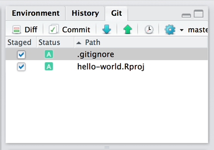
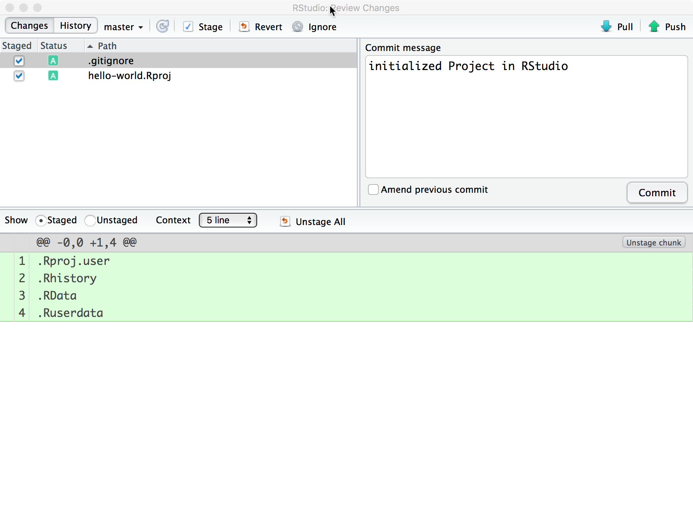
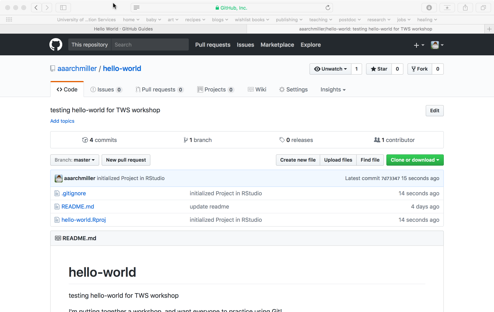

```{r setup, include=FALSE}
knitr::opts_chunk$set(echo = TRUE, eval=FALSE)
options(width=300)
```

### Requirements

Program R <https://www.r-project.org/>

RStudio <https://www.rstudio.com/products/RStudio/>

Git <https://git-scm.com>

GitHub account <https://github.com/>

- You can use an educational email address to get free private repositories through GitHub Educational <https://education.github.com/> 
- Or use any email to get unlimited public repositories
- You can also upgrade for fairly cheap to buy unlimited private repositories.

*Private repositories are helpful for research projects in progress, protecting your work until you are ready to publish.*

## Instructions for setting up Git using GitHub and RStudio

At the end of this introduction, you will have made a new repository on the GitHub website; sync the repository with an RStudio project file on your local computer; and commit and push a modification back up to GitHub's website. If at any point you run across errors or concerns, please email Althea at althea.archmiller [at] gmail [dot] com. 

### Step 1. Create a GitHub account and complete Hello World tutorial

The first step is to simply perform all the steps in the GitHub tutorial, "Hello World." The tutorial can be found at https://guides.github.com/activities/hello-world/.

Your new repository on GitHub should be something like: **github.com/aaarchmiller/hello-world** (although "aaarchmiller" should be replaced with your GitHub account username).

### Step 2. Sync your GitHub Account and RStudio

#### Set up SSH key

An SSH key allows your computer to talk directly with your GitHub account. Only do this step on a computer that you will frequently be using with RStudio and GitHub. *If you are on a public computer or a borrowed laptop for the workshop, we recommend skipping this step.*

1. Open RStudio and Tools > Global Options
2. Click on Git/SVN tab on left column of Global Options


3. Click on "Create RSA Key..."
4. Do **not** enter anything in the passphrase
5. The default path should be fine, so I recommend leaving at default.


6. Click "Create" and you will see something like this: 


7. Click "Close" and then "View Public Key" and you should see something like this: 


8. Copy the entire text box, starting with "ssh-rsa...", then hit "close" and "OK."
9. Log into your GitHub account.
10. Navigate to your settings. (Click on your profile picture on the top right of the screen, then Settings)
11. Click on the SSH and GPG keys tab on the left column, and you should see something like this (although empty because you have yet to add a key):


12. Click on green "New SSH key"
13. Name it something like "My work laptop"
14. Paste in the text, which should start with "ssh-rsa ..."
15. Click green "Add SSH key" button.

### Step 3: Create a new project in RStudio and sync with hello-world

1. Open RStudio, go to File > New Project


2. Select "Version Control" and then "Git"


3. Paste in the URL for *your* Hello World respository (something like: https://github.com/yourusername/hello-world). Make sure you're happy with the location on the harddrive that it will be saved to and select "Create Project"


### Step 4. Commit some changes in RStudio and push them to GitHub

1. You should now see a "Git" tab in the upper right window of RStudio. Click on that tab and you should see "hello-world.Rproj" and ".gitignore" listed in that tab.

*Note: you may also see a ".DS_store" file if you are using a Mac. This is just a hidden file that Mac uses to store your preferences for how each folder appears in Finder. You may disregard this for now, or check it along with "hello-world.Rproj" in the next step.*

2. Click on the squares next to "hello-world.Rproj" and ".gitignore" which will stage them for your commit. 


3. Click on "Commit" and you will see a new window pop-up. 
4. Type "initialized Project in RStudio" in the commit message box and click on the "Commit" button.


5. Send the newest commit to GitHub by pressing the Push button. 
6. Open up your repository in GitHub to make sure that the newest commit was successfully pushed to GitHub from RStudio.


If you have completed all of these steps, you are now ready to participate in the workshop--and use GitHub for your own projects. Again, contact Althea (althea.archmiller [at] gmail [dot] com) if you have any problems!