```{r setup, include=FALSE}
knitr::opts_chunk$set(echo = TRUE, eval=FALSE)
options(width=300)
```

## Overview and Introduction

### Requirements

Program R <https://www.r-project.org/>

RStudio <https://www.rstudio.com/products/RStudio/>

Git <https://git-scm.com>

GitHub account <https://github.com/>

- You can use an educational email address to get free private repositories through GitHub Educational <https://education.github.com/> 
- Or use any email to get unlimited public repositories
- You can also upgrade for fairly cheap to buy unlimited private repositories.

*Private repositories are helpful for research projects in progress, protecting your work until you are ready to publish.*

## Instructions for setting up Git using GitHub and RStudio

At the end of this introduction, you will add your name to the workshop roll call, signalling to the instructors that you have successfully set up GitHub. If at any point you run across errors or concerns, please email Althea at althea.archmiller [at] gmail [dot] com. 

### Step 1. Sync your GitHub Account and RStudio

#### Set up SSH key

An SSH key allows your computer to talk directly with your GitHub account. Only do this step on a computer that you will frequently be using with RStudio and GitHub. *If you are on a public computer or a borrowed laptop for the workshop, we recommend skipping this step.*

1. Open RStudio and Tools > Global Options
2. Click on Git/SVN tab on left column of Global Options


3. Click on "Create RSA Key..."
4. Do **not** enter anything in the passphrase
5. The default path should be fine, so I recommend leaving at default.


6. Click "Create" and you will see something like this: 


7. Click "Close" and then "View Public Key" and you should see something like this: 


8. Copy the entire text box, starting with "ssh-rsa...", then hit "close" and "OK."
9. Log into your GitHub account.
10. Navigate to your settings. (Click on your profile picture on the top right of the screen, then Settings)
11. Click on the SSH and GPG keys tab on the left column, and you should see something like this (although empty because you have yet to add a key):


12. Click on green "New SSH key"
13. Name it something like "My work laptop"
14. Paste in the text, which should start with "ssh-rsa ..."
15. Click green "Add SSH key" button.

Now you're all set! 

### Step 2: Clone a version of the roll-call repository to your computer

In this section, you will clone a version of the roll-call repository to your 
computer and eventually modify the text file "roll_call" so that the instructors
can verify that you have successfully prepared for the workshop activities. (These steps loosely follow http://r-bio.github.io/intro-git-rstudio/.)

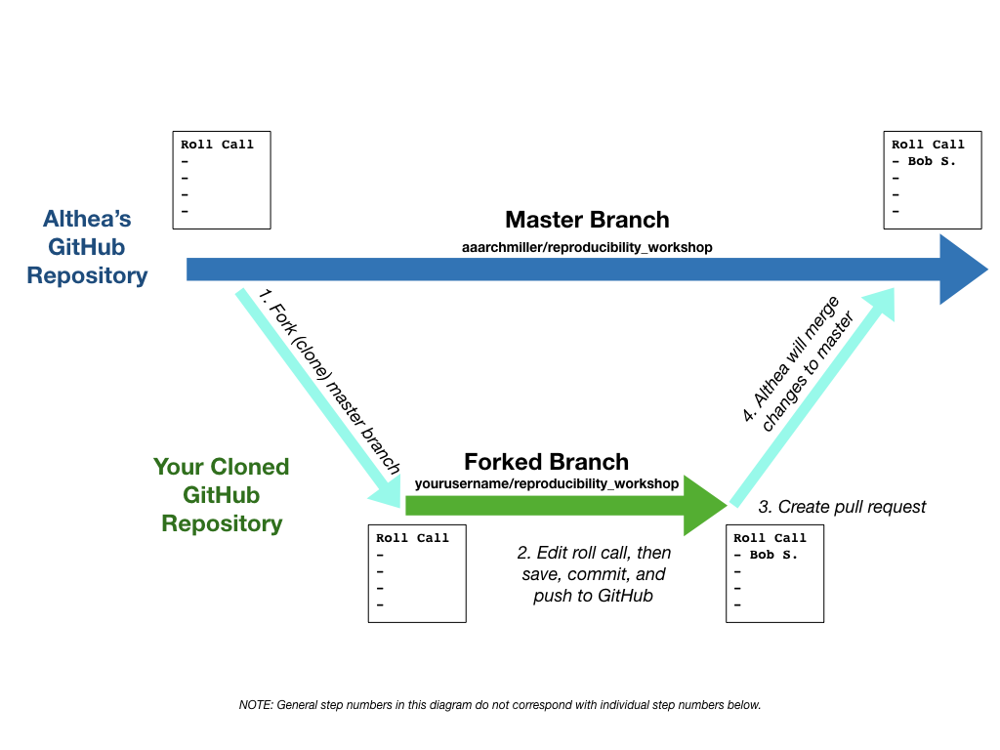


1. Navigate to the workshop repository (https://github.com/aaarchmiller/roll_call) on GitHub
2. Click "Fork" in the upper right hand corner. This will create a cloned branch in your own GitHub account (Forked Branch in the image above). Copy the URL for *your* branch (something like: https://github.com/yourusername/roll_call).
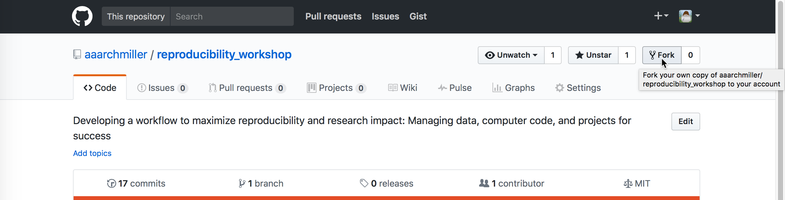

3. Open RStudio, go to File > New Project
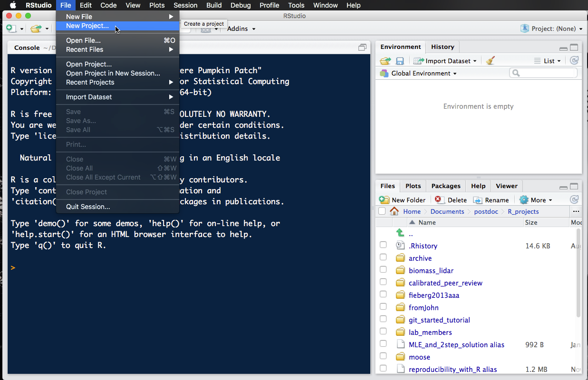

4. Select "Version Control" and then "Git"

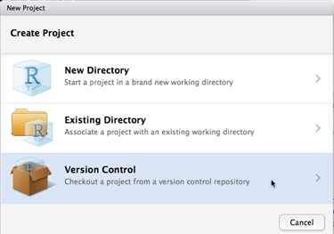
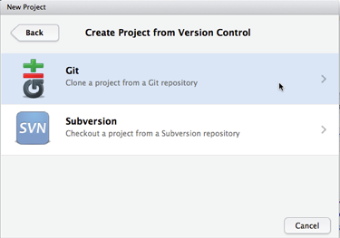

5. Paste in the URL for *your* branch (something like: https://github.com/yourusername/reproducibility_workshop). Make sure you're happy with the location on the harddrive that it will be saved to and select "Create Project"
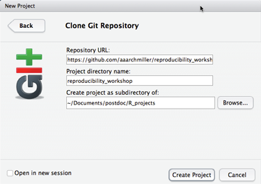

6. Now, in order to link this project with Althea's "upstream" version, we will use the shell and the **git** language directly. Open the shell by selecting Tools > Shell...
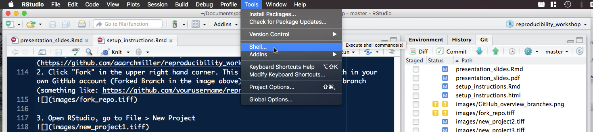

7. Type in (exactly; cannot copy/paste) and hit Enter:

```{r shell1, eval=F, echo=T}
git remote add upstream https://github.com/aaarchmiller/reproducibility_workshop
```

### Step 3: Add your name to roll_call.txt

1. In the Files tab of RStudio (bottom right), you should see roll_call.txt. Open that file up, add your name, and save.
2. In the Git tab of RStudio (top right), you should now see roll_call show up.
3. Select roll_call by clicking in the box to the left of it (a check mark should appear).
4. Click "Commit" button and a new window should appear:
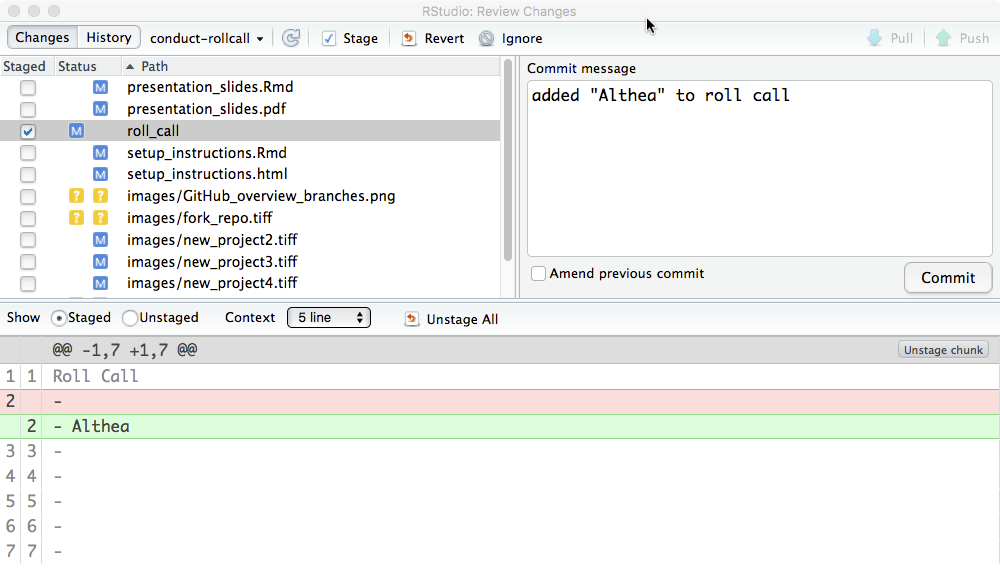

5. Type in an informative "commit message" like above
6. Select the "Commit" button. You may get a message like this, which you can disregard.

```{r shellx, eval=F, echo=T}
[conduct-rollcall 942752f8] Added name to roll_call
 Committer: Firstname Lastname <email@place.edu>
Your name and email address were configured automatically based 
on your username and hostname. Please check ...
```

7. Now you will push the commit to your repository on GitHub. You can do this with the **green arrow** (push) in the Git tab of RStudio, or in shell. To do this in shell, simply  type in this (exactly; cannot copy/paste) and hit Enter:
```{r shell3, eval=F, echo=T}
git push origin master
```

Note: A prompt may appear asking for you to enter your username and password for GitHub. If it does, just enter the same username and password as you used to make your GitHub account. (This is platform-specific, don't worry if it doesn't appear). 

Now, you have changed roll_call in your forked branch (i.e., your version of the repository). To verify, you should be able to see your name on roll_call.txt on the GitHub website (on your forked repository, it has not yet been merged with Althea's master branch).

The next step is to send your modified roll_call.txt version to the instructors to merge with the original branch. 

### Step 4: Add your roll_call modifications to Althea's repository

1. Go to your forked repository on the GitHub website.
2. Click on the grey "pull request" button.
3. Now, click on the green "Pull request" link. 
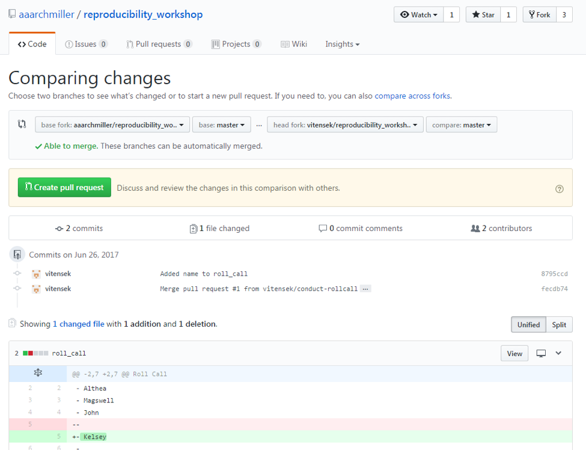
4. Add "Yourname roll call" as title, with a short message:
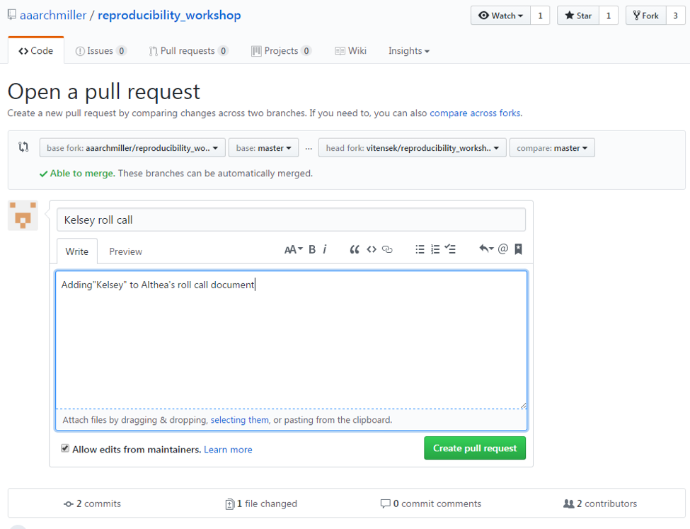
5. Verify that base fork and head fork match above screen shot, except with yourusername instead of "vitensek". Now, create the pull request (green button).
6. There should be no conflicts (as in image below), and this will send an email to Althea asking for her to view your changes and accept them into her main repository.
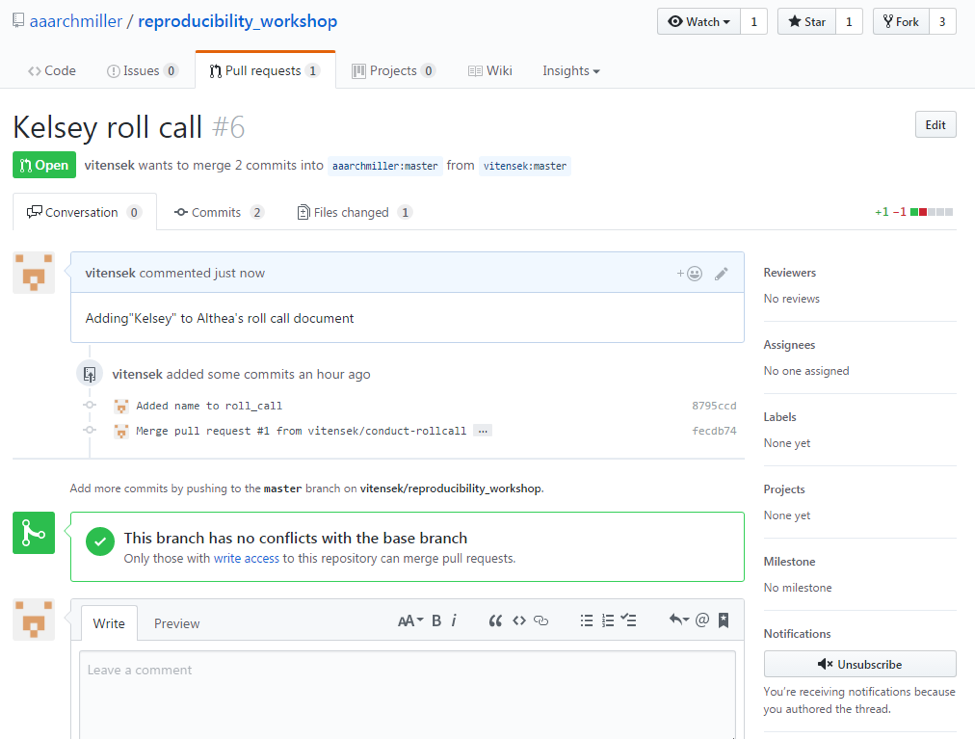


If you have completed all of these steps, you are now ready to participate in the workshop--and use GitHub for your own projects. Again, contact Althea (althea.archmiller [at] gmail [dot] com) if you have any problems!