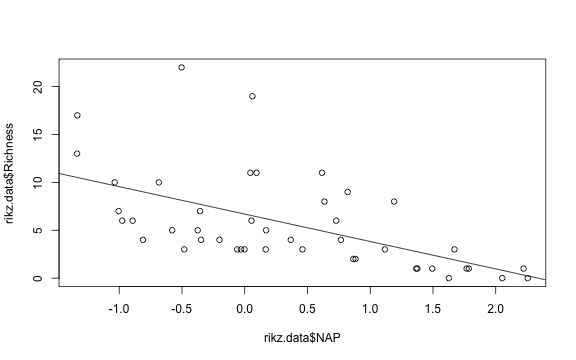

# Linear regression of RIKZ data
Preamble - load libraries and clear environment


```r
remove(list=ls())
```

## Step 1. Load data


```r
load("data/processed_data/rikz.Rdata")
```

## Step 2. Linear regression


```r
lm.out <- lm(Richness~NAP, data = rikz.data)
summary(lm.out)
```

```
## 
## Call:
## lm(formula = Richness ~ NAP, data = rikz.data)
## 
## Residuals:
##     Min      1Q  Median      3Q     Max 
## -5.0675 -2.7607 -0.8029  1.3534 13.8723 
## 
## Coefficients:
##             Estimate Std. Error t value Pr(>|t|)    
## (Intercept)   6.6857     0.6578  10.164 5.25e-13 ***
## NAP          -2.8669     0.6307  -4.545 4.42e-05 ***
## ---
## Signif. codes:  0 '***' 0.001 '**' 0.01 '*' 0.05 '.' 0.1 ' ' 1
## 
## Residual standard error: 4.16 on 43 degrees of freedom
## Multiple R-squared:  0.3245,	Adjusted R-squared:  0.3088 
## F-statistic: 20.66 on 1 and 43 DF,  p-value: 4.418e-05
```

## Step 3. Plot results


```r
plot(rikz.data$NAP, rikz.data$Richness)
abline(lm.out)
```



### Footer 

Session Information


```r
devtools::session_info()
```

```
## Session info --------------------------------------------------------------
```

```
##  setting  value                       
##  version  R version 3.3.2 (2016-10-31)
##  system   x86_64, darwin13.4.0        
##  ui       RStudio (1.0.143)           
##  language (EN)                        
##  collate  en_US.UTF-8                 
##  tz       America/Chicago             
##  date     2017-07-24
```

```
## Packages ------------------------------------------------------------------
```

```
##  package     * version date       source        
##  backports     1.0.5   2017-01-18 CRAN (R 3.3.2)
##  devtools      1.12.0  2016-06-24 CRAN (R 3.3.0)
##  digest        0.6.12  2017-01-27 CRAN (R 3.3.2)
##  evaluate      0.10    2016-10-11 CRAN (R 3.3.0)
##  ezknitr     * 0.6     2016-09-16 CRAN (R 3.3.0)
##  highr         0.6     2016-05-09 CRAN (R 3.3.0)
##  htmltools     0.3.5   2016-03-21 CRAN (R 3.3.0)
##  knitr         1.15.1  2016-11-22 CRAN (R 3.3.2)
##  magrittr      1.5     2014-11-22 CRAN (R 3.3.0)
##  markdown      0.7.7   2015-04-22 CRAN (R 3.3.0)
##  memoise       1.0.0   2016-01-29 CRAN (R 3.3.0)
##  mime          0.5     2016-07-07 CRAN (R 3.3.0)
##  R.methodsS3   1.7.1   2016-02-16 CRAN (R 3.3.0)
##  R.oo          1.21.0  2016-11-01 CRAN (R 3.3.0)
##  R.utils       2.5.0   2016-11-07 CRAN (R 3.3.0)
##  Rcpp          0.12.9  2017-01-14 CRAN (R 3.3.2)
##  rmarkdown     1.3     2016-12-21 CRAN (R 3.3.2)
##  rprojroot     1.2     2017-01-16 CRAN (R 3.3.2)
##  rstudioapi    0.6     2016-06-27 CRAN (R 3.3.0)
##  stringi       1.1.2   2016-10-01 CRAN (R 3.3.0)
##  stringr       1.1.0   2016-08-19 CRAN (R 3.3.0)
##  withr         1.0.2   2016-06-20 CRAN (R 3.3.0)
##  yaml          2.1.14  2016-11-12 CRAN (R 3.3.2)
```


